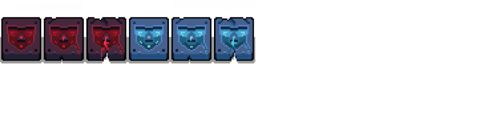

I've been working on a game about electronics and information security for about two months now, and I've finally completed a game design document for it.

Here's a quick video preview of what the game looks like. It's got two enemies (one isn't shown here), a very programatically convoluted spawning system, two logic gate towers, and a rather limited sense of progression.



Trac3 was going to be designed with rather unconventional genre in mind - a roguelite tower-defense-arena-shooter with elements of strategy and RPG-style character progression, played on progressively more complex PCBs and circuits.

My idea was that the player would be some sort of physical malware, deployed to destroy hardware and combat antivirus applications. It would utilize the PCB trace (the yellow lines) to power offensive tower units and destroy the opposing anti-malware enemies. Some sub-objectives were established in each level, such as destroying shield towers and enemy spawn points to replace them with your own.

## The GDD

I didn't feel like I had a good sense of direction with where I was going, so I decided to write up a game design document, using [this template](https://www.gamasutra.com/blogs/LeandroGonzalez/20160726/277928/How_to_Write_a_Game_Design_Document.php) from Leandro Gonzales. I figured out a lot of the core mechanics of my game, and I think I have a much better sense of where I should be going with this.

For example, these are the tower units that I've decided to make so far.

I've begun making the Shield Tower sprite, and I'm really thinking about how to incorporate this into the logic of my game. Currently, tower prefabs are built with a rangefinder component and a tower-sprite component. Their abilities and appearances are controlled inside the parent host component, and toggled by several switch statements.

Primary _shield tower sprite work._

Also, I've thought of some interesting characters (based on malware) and enemies (based on gladiators), which would definitely be interesting though perhaps difficult to balance.

I think this will take long enough to implement - each enemy prototype (non-sprited, non-animated, just the logic/AI behavior) will take about 4 hours of work to add, and players will definitely take much longer.

There's definitely a long road of work to do ahead, and I can see myself finishing this at the end of the year if I really gave it my all. I hope to make the music myself, but I'm coming to realize that my sense of rhythm is very temperamental, and I can follow a metronome for only about 5 seconds before I go off the beat.

## Conclusion

I think writing a GDD is a good idea to figure out the core of a game and get a wide-angle view of what needs to be done, and when. Perhaps splitting this up in Trello or on my Kanban board would be a good idea, but for now here's my immediate TO-DO list to implement the first level fully - with the proper enemy defense and control circuit setups (the latter needs to be sprited and prefab'd), and complete the overall progression (including the progress bar at the bottom):

#### TO DO
 
1. Figure out how to add the Shield IC to the game 
2. Add IC tower effects on activation
3. Correct the spawn system so it can be trigger programatically - I'll probably need to design this on paper first as it's going to end up being quite complicated \[Components: SpawnInterval, EnemyComposition, Triggers\]\[Queue or List Datastructure\]
4. Add in the Akimbo enemy - just create its attack sprite, the attack prefab, and the Akimbo enemy behavior AI

Thanks for following me if you've gotten this far, and I hope that you continue to join me as I work on **Trac3**. Happy designing!
